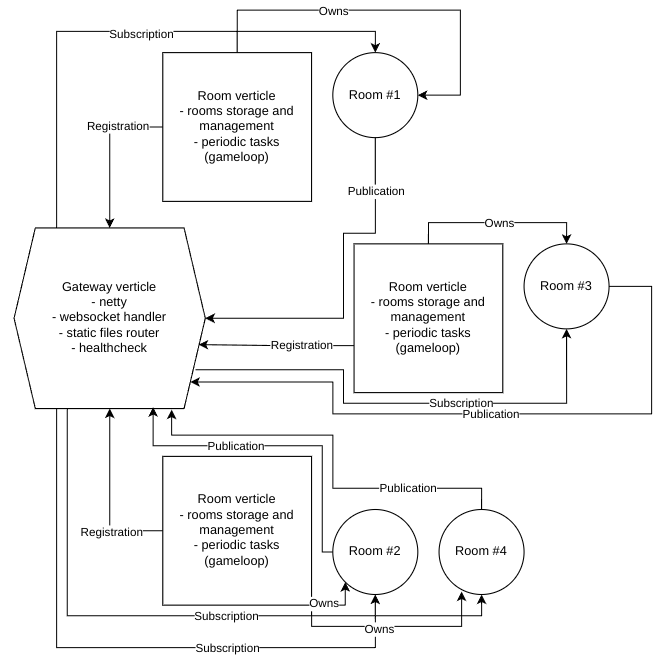

## "Orbital" vert.x game server

This is the repository for "Orbital" vert.x game server library. This is high-performance vert.x based java game server designed for realtime 2D/3D shooters,
rpg games and any others requiring low-latency realtime computations.

The server contains example server, basic game loops, matchmaking, room management functionality and it is about to have further improvements.

Supports:
* HTTP
* websocket

Features currently in development:
* 2D/3D geometry and grid systems
* TCP/UDP server mode
* Extended room management
* HTTP monitoring
* Extended player management
* Auth-protected REST API
* Extended basic game objects (strikes, loot, handlers)

## Core and architecture

The solution is based on Vert.X "Actor" approach and EventBus features. It allows to have Indefinite amount of
room management verticles as workers to process game messages. Here's the picture describing typical distributed
game server architecture:

The code of "Orbital" is conceived to be extended and modernized on your own.

For the moment core contains:
* Gateway verticle basic functionality
* Room verticle basic functionality
* EventBus-based room listener system
* 2D geometry
* Basic rooms
* Package classes
* Annotation-based incoming message handlers