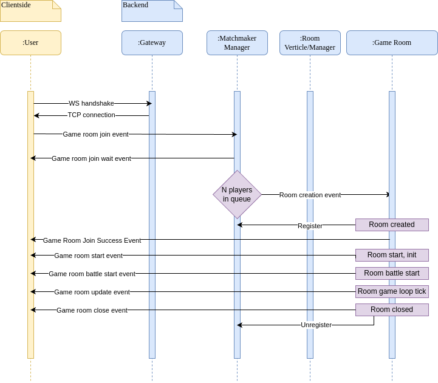
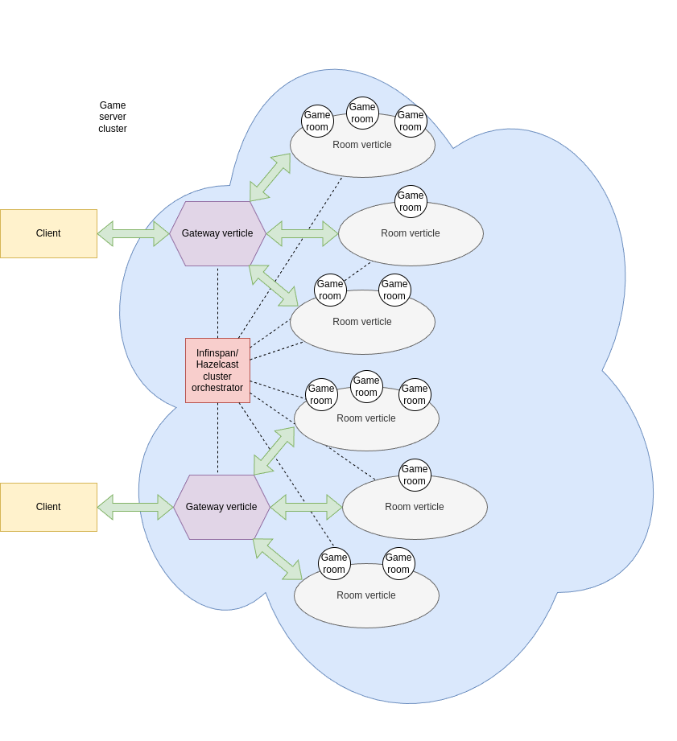

<h1 align="center">
   
  
   
  Orbital
   
</h1>

<h4 align="center">
This is high-performance vert.x based distributed java game server designed for realtime 2D/3D multiplayer games requiring low-latency realtime computations</h4>

  

---

**Project is in active development. Looking for contributors and sponsors to make this stuff widely used in future**

Supports:

* HTTP
* Websocket

Features of core:

* GameApplication launcher
* Gateway verticle basic functionality
* Room verticle basic functionality
* EventBus-based room listener system
* 2D geometry
* Basic rooms
* Package classes
* Annotation-based incoming message handlers

Currently, in development:

* GraalVM native image optimizations
* 2D/3D geometry and grid systems
* TCP/UDP server mode
* Advanced room management, player management, admin/monitoring page https://github.com/tfkfan/orbital-monitor
* Auth-protected REST API
* Advanced basic game objects (strikes, loot, handlers)
* Infinispan-clustered game server mode

## Core and architecture

The solution is based on Vert.X "Actor" approach and EventBus features. It allows to have Indefinite amount of
room management verticles as workers to process game messages.
The code of "Orbital" is conceived to be extended and modernized on your own.
The basic features are verticles and managers encapsulating business logic of the game.
Following image represents internal framework architecture

Orbital cluster is easy reachable according this schema:

