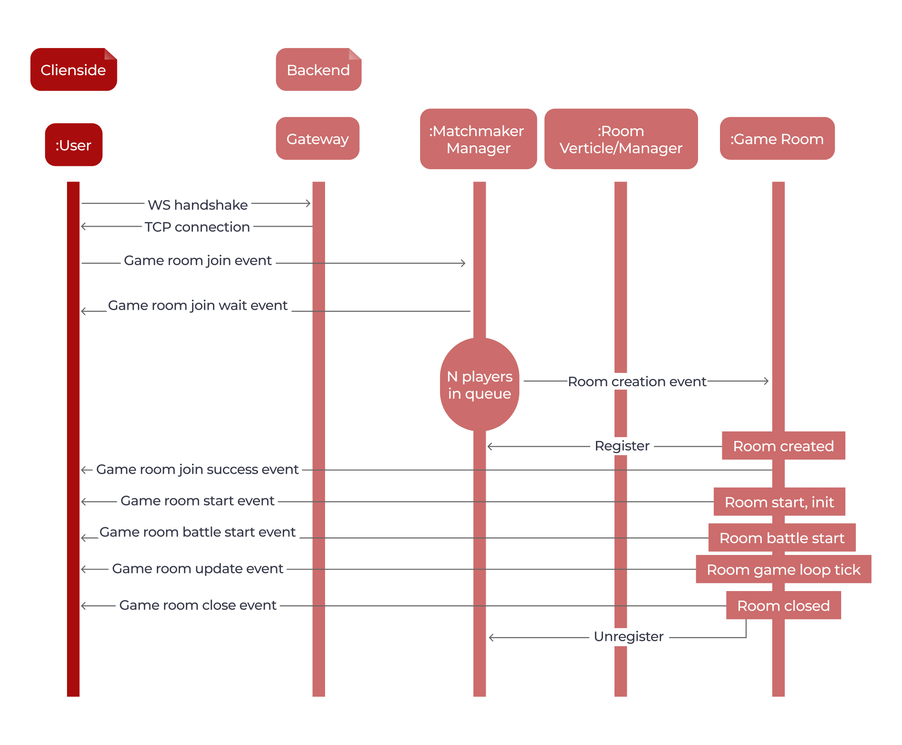
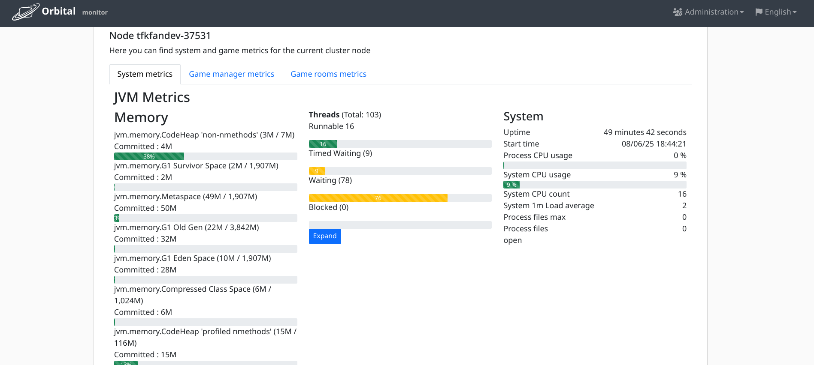

<h1 align="center">
  <br>
  <a href="#"></a>
  <br>
  Orbital
  <br>
</h1>

<h4 align="center">
This is high-performance vert.x based distributed java game server designed for realtime indie multiplayers development</h4>

<p align="center">
  <a href="https://opensource.org/licenses/MIT" title="License: MIT" >
    
  </a>
</p>

---

**Project is in active development. Looking for contributors and sponsors to make this stuff widely used in future**

Supports:

* HTTP
* Websocket

Features:

* GameApplication launcher
* Gateway verticle basic functionality
* Room verticle basic functionality
* EventBus-based room listener system
* 2D geometry
* Lucene and spatial geo indices (JTS based)
* Basic rooms
* Package classes
* Micrometer + prometheus metrics and monitor web page https://github.com/tfkfan/orbital-monitor
* Annotation-based incoming message handlers
* English/Russian web app localization

Backlog:

* GraalVM native image optimizations
* TCP/UDP server mode
* Advanced room management, player management, admin page https://github.com/tfkfan/orbital-monitor
* Auth-protected REST API and social accounts oidc providers (google,vk,facebook,X etc...)
* Advanced basic game objects
* Payments api integrations
* Meta game logic tools
* Infinispan-clustered game server mode

## Core and features

The solution is based on Vert.X "Actor" approach and EventBus features. It allows to have Indefinite amount of
room management verticles as workers to process game messages.
The code of "Orbital" is conceived to be extended and modernized on your own.
The basic features are verticles and managers encapsulating business logic of the game.
Following image represents internal framework architecture



Orbital cluster is easy reachable according this schema:


## Usage

See "example" module for complete starter. Please pay attention example already contains frontend resources.

### Requirements

Before running your first orbital game server your app should have:

- GameManager implementation
- Player model implementation
- Game room implementation

### Launch

To run orbital microcluster with gateway verticle and N room verticles write:

```
public static void main(String[] args) {
    final Vertx vertx = Vertx.vertx();

    int N = 10;
    new Orbital(vertx)
                .withConfig(N, new RoomConfig())
                .withWebsocketGateway(it ->
                        it.withRouterInitializer(router -> router.route().handler(StaticHandler.create("static")))
                                .withRouterInitializer(MonitorEndpoint::create))
                .withGameManagerFactory(config -> DefaultGameManager.factory(config.getRoom()))
                .withRoomClusterLauncher(pair -> new RoomDeploymentConfig(new DeploymentOptions()
                        .setThreadingModel(ThreadingModel.VIRTUAL_THREAD)
                        .setWorkerPoolSize(100)))
                .run();
}
```

## Monitoring

### Setup

To setup monitor-related instance add required dependency:

```
<dependency>
    <groupId>io.github.tfkfan</groupId>
    <artifactId>orbital-monitor</artifactId>
    <version>1.2.0</version>
</dependency>
```

Your vertx instance should be monitorable this way:

```
final Vertx vertx = new MonitorableVertx().build();
```

You can specify certain metrics binders and registries on your own:

```
final Vertx vertx = new MonitorableVertx(registry).build();
```

```
final Vertx vertx = new MonitorableVertx(registry, new JvmHeapPressureMetrics()).build();
```

Final step is static monitor resources linking with gateway verticle:

```
final GatewayVerticle gatewayVerticle = new WebsocketGatewayVerticle(serverConfig, roomConfig)
                            .withRouterInitializer(MonitorEndpoint::create);
```

### Web app

The monitor app allows you to check every metrics:





### Endpoints

Server port is 8085 by default

- Monitor web app is available at http://localhost:8085/monitor
- Prometheus metrics are available at http://localhost:8085/prometheus
- JSON metrics are available at http://localhost:8085/metrics
